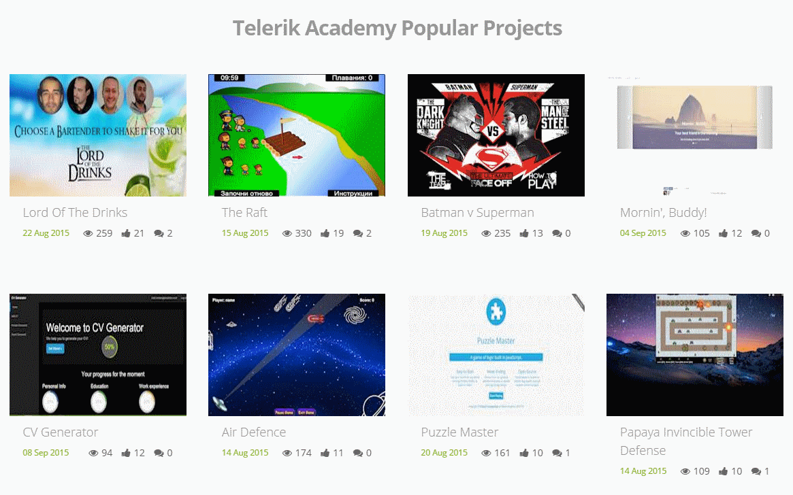
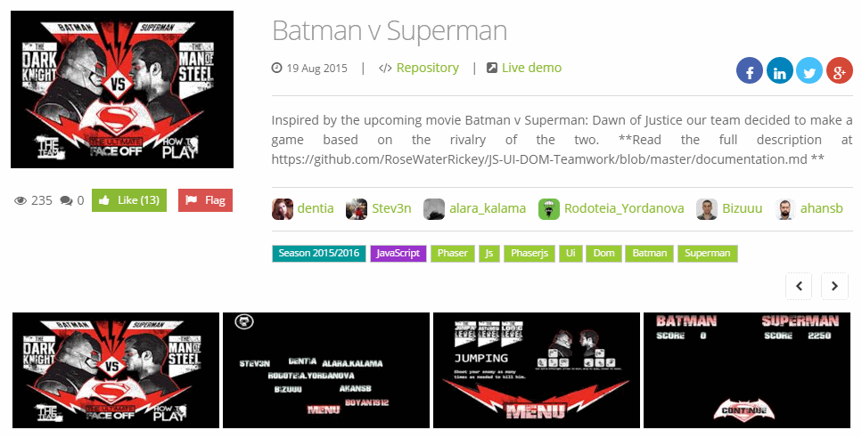

## Working with Remote Data Homework

Create an Universal Windows Platform Application that visualizes the best Telerik Academy projects.

Use http://best.telerikacademy.com/api/projects/popular as a source for your data.

Your application should look good in both Windows 10 and Windows 10 Mobile

Sample applications UI:

Optionally you can create a separate page for visualizing each of the projects individually.

For each individual project use for http://best.telerikacademy.com/api/projects/26/Batman-v-Superman for example as a source for your data.

